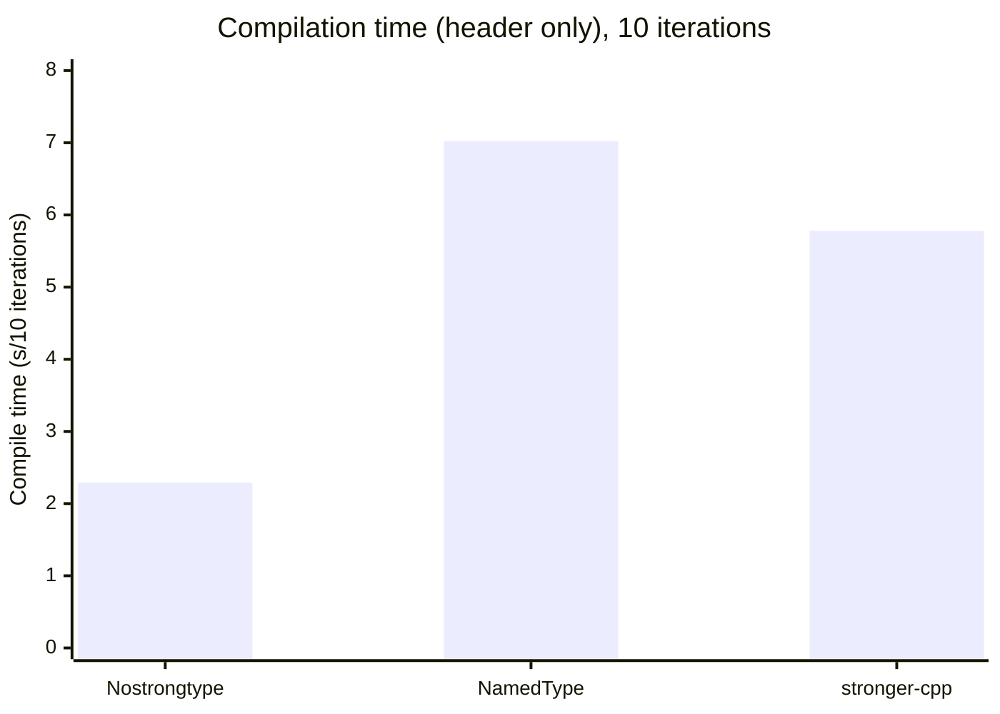
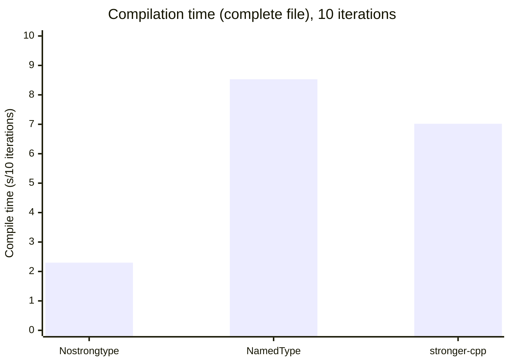
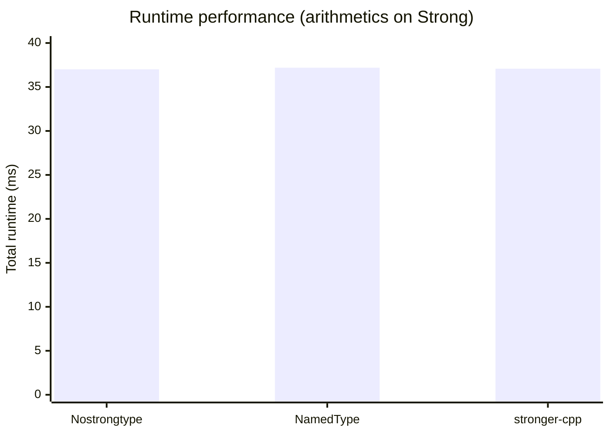

# stronger-cpp [](https://github.com/Teskann/stronger-cpp/actions/workflows/ci.yml) [](https://github.com/teskann/stronger-cpp/actions/workflows/cpm.yml)

### Single-header C++23 strong typing library

*Strong typing prevents implicit conversions between unrelated types,
making it harder to accidentally mix or misuse variables in C++ code.*

---

### Features

- ✅ Automatic propagation of underlying type operators and other skills
- ✅ No memory overhead
- ✅ No visible runtime overhead. <sup>[[see more]](#runtime)</sup>
- ✅ Tested at compile time (strong guarantee against undefined behaviors)

## Table of Contents

* [Usage](#usage)
    * [Basics](#basics)
    * [Underlying data access](#underlying-data-access)
    * [In-place construction](#in-place-construction)
    * [Working with strong bools](#working-with-strong-bools)
    * [Working with strong pointers](#working-with-strong-pointers)
    * [Working with strong containers](#working-with-strong-containers)
    * [Working with strong functions](#working-with-strong-functions)
    * [Options](#options)
    * [Notes about `stronger::tag()`](#notes-about-strongertag)
* [Comparison with NamedType library by @joboccara](#comparison-with-namedtype-library-by-joboccara)
    * [Inherited operations](#inherited-operations)
* [Benchmarks](#benchmarks)
    * [Compile-time](#compile-time)
        * [Compiling the library header](#compiling-the-library-header)
        * [Compiling C++ file](#compiling-this-cpp-file)
    * [Runtime](#runtime)
* [Get it](#get-it)
  * [From release](#from-release)
  * [CPM](#using-cpm)
* [Build from source](#build-from-source)
    * [Debug](#debug)
    * [Release](#release)
* [Supported Compilers](#supported-compilers)
    * [gcc](#gcc)
    * [MSVC](#msvc)
    * [clang](#clang)

## Usage

### Basics

```C++
#include <stronger.hpp>

using Amount = stronger::strong_type<double, stronger::tag()>; 
using Name = stronger::strong_type<std::string, stronger::tag()>;
```

Once declared, you can use `Amount` and `Name` in your code:

```C++
void print_info(const Name& name, Amount amount) {
    std::println("{} gave {.2f}$", name, amount);
}

Name alice{"Alice"s};
Amount alice_donation{100.0};

print_info(alice, alice_donation);
// print_info("Paul"s, 250.0);  // Error: cannot convert from std::string to Name, and from double to Amount
```

Arithmetics of the underlying type are automatically available:

```C++
Amount item1 = 100.0;
Amount item2 = 200.0;
Amount total = item1 + item2;  // No implicit conversions here
```

### Underlying data access

You can use `operator*` to access the underlying type.

```C++
double underlying_value = *alice_donation;
const std::string& underlying_string = *alice;
std::string underlying_string = *std::move(alice);  // On r-value qualified strong types, the underlying type is moved.
```

You can use `operator->` to access the underlying type methods and members.

```C++
size_t size = alice->size();
alice->append(" in wonderland");
```

### In-place construction

You can use `stronger::make_strong<S>(...)` to create a `strong type` in-place.

```C++
using List = stronger::strong_type<std::vector<double>, stronger::tag()>;

const auto list = stronger::make_strong<List>(1.0, 2.0, 3.0, 4.0, 5.0);
```

### Working with strong bools

Calling functions with bool arguments is usually confusing.

```
set_options(true, false);  // What does this mean ?
```

Using `stronger::strong_bool` in the function signature makes it easier to understand:

```C++
using enable_auto_save = stronger::strong_bool<stronger::tag()>;
using enable_always_show = stronger::strong_bool<stronger::tag()>;

void set_options(enable_auto_save autoSave, enable_always_show alwaysShow);

// Much easier to understand
set_options(enable_auto_save(true), enable_always_show(false));

// set_options(true, false);  // Does not compile
// set_options(enable_auto_save(true), enable_always_show(false));  // Does not compile: swapped arguments
```

> [!NOTE] 
> `strong_bool<Tag>` is a simple alias for `strong_type<bool, Tag>`

> [!IMPORTANT]
> `operator&&` and `operator||` are intentionally not
> overloaded for `strong_type` because they would not support [short-circuit evaluation](https://en.wikipedia.org/wiki/Short-circuit_evaluation).
> You cannot use `&&` or `||` on `strong_bools` directly.

Using `stronger::weak_bool` allows implicit conversions to `bool`, so that you can use logical
operators *as if they were supported natively.*

```C++
using enable_auto_save = stronger::weak_bool<stronger::tag()>;
using enable_always_show = stronger::weak_bool<stronger::tag()>;

bool result = autoSave && alwaysShow;
```

### Working with strong pointers

[Drill-down behavior](https://en.cppreference.com/w/cpp/language/operator_member_access.html)
of `operator->` is implemented for raw pointers.

```C++
using NamePtr = stronger::strong_type<std::string*, stronger::tag()>;
std::string alice = "Alice"s;
const NamePtr namePtr(&alice);

alice->starts_with("A");  // Ok
```

You can use option `drill_down` to enable this behavior on other types.

```C++
using NamePtr = stronger::strong_type<std::unique_ptr<std::string>, stronger::tag(), stronger::options::drill_down>;
const NamePtr alice(std::make_unique<std::string>("Alice"s));;

alice->starts_with("A");  // Ok
// alice->reset(); // Error, std::unique_ptr::reset is not available anymore
```


### Working with strong containers

A strong type of iterable object is iterable as well.

```C++
using NameList = stronger::strong_type<std::vector<std::string>, stronger::tag()>;

const auto names = stronger::make_strong<NameList>("Alice"s, "Bob"s, "Charlie"s);

// begin() and end() are available
for (const std::string& name : names)
    std::println("{} is present on the list.", name);

// operator[] is available
std::println("{} is the first on the list !", names[0ULL]);
```

### Working with strong functions

It is also possible to work with strong functions. If you ever need it, here is the way:

```C++
template<typename Callable>
using Function = stronger::strong_type<Callable, stronger::tag()>;

template<typename Callable>
void print(Function<Callable> f, double x)
{
    std::println("f({}) = {}", x, f(x));
}

auto f = stronger::make_strong<Function>([](double x) { return x * x; });
print(f, 10.0);  // prints "f(10) = 100"
```

### Options

Some options can be enabled to customize the behavior of strong types.

```C++
using Price = stronger::strong_type<double, stronger::tag(), stronger::options::allow_implicit_conversion_to_underlying_type>; 
using Name = stronger::strong_type<std::string, stronger::tag(), stronger::options::allow_implicit_construction>;
using NamePtr = stronger::strong_type<std::unique_ptr<std::string>, stronger::tag(), stronger::options::drill_down>;
```

Options can be combined.

### Notes about `stronger::tag()`

The goal of tagging is to avoid this:

```C++
using Width = stronger::strong_type<double>;
using Height = stronger::strong_type<double>;
static_assert(std::is_same_v<Width, Height>);  // We don't want this !
```

The first try could be to use a non-type template parameter in `strong_type` that defaults to `[]{}`.
But this would cause link issues: the type would be different for the same
`using` declaration in two different translation units. So we have to use a
template parameter that is not defaulted.

`stronger::tag()` generates a unique `size_t`, from hashing the result of [
`std::source_location::current()`](https://en.cppreference.com/w/cpp/utility/source_location/current).
Note that it does not hash the full path of the file, but only the file name, line number, column and function name.

`stronger::tag()` should work fine in most cases. If you face link issues, you can
use `stronger::tag(const char*)`.
The result of hashing is guaranteed to be the same no matter the source location.

```C++
using MyInt = stronger::strong_type<int, stronger::tag("MyInt")>;
```

Maybe you should prefer this option if you want to create a library that is released with binaries.

## Comparison with [NamedType](https://github.com/joboccara/NamedType) library by [@joboccara](https://github.com/joboccara)

**stronger-cpp** simplifies strong type declaration. It addresses several
issues from NamedType,
like [ambiguous operators](https://github.com/joboccara/NamedType/issues?q=is%3Aissue%20ambiguous) or
[suboptimal size of strong types](https://github.com/joboccara/NamedType/issues/51).

It also compiles faster.

| Operation                                       | NamedType                                | stronger-cpp                                    |
|-------------------------------------------------|------------------------------------------|-------------------------------------------------|
| Minimum C++ standard required                   | C++14                                    | C++23                                           |
| `sizeof (StrongType)`                           | ⚠️ `>= sizeof(Underlying)`<sup>[1]</sup> | `== sizeof(Underlying)`                         |
| Operators                                       | Member functions                         | Friend functions                                |
| Operator arguments                              | Always `const &`                         | `const &` or value, depending on what is faster |
| Inherit underlying type skills                  | Explicit                                 | ✅ Automatic                                     |
| Making strong type unique                       | `struct ActualTypeTag`                   | `stronger::tag()`                               |
| [Compilation time](#compile-time)               | Slower                                   | ✅ About 20% faster                              |
| Tests                                           | Runtime tests                            | ✅ Fully compile-time tested <sup>[2] [3]</sup>  |
| Access underlying data                          | `s.get()`, `*s`, `s->someFunction()`     | `*s`, `s->someFunction()`                       |
| Access underlying data from expired strong type | Makes a copy                             | ✅ Moves                                         |
| In-place construction                           | ❌                                        | `stronger::make_strong<S>(...)`                 |
| Named arguments                                 | ✅                                        | ❌                                               |

<sup>[1]</sup>: This will be `== sizeof(Underlying)` only if empty base optimization is enabled.

<sup>[2]</sup>: This offers a strong guarantee against undefined behaviors.

<sup>[3]</sup>: Except formatting with `std::format` because this feature is not available at compile time. It is
tested at runtime
anyway.

### Inherited operations

Assume `a` and `b` are both of type `StrongType`.

| Operation                  | NamedType | stronger-cpp     |
|----------------------------|-----------|------------------|
| `+a`<sup>[1]</sup>         | ✅         | ✅                |
| `-a`<sup>[1]</sup>         | ✅         | ✅                |
| `a + b`<sup>[1]</sup>      | ✅         | ✅                |
| `a - b`<sup>[1]</sup>      | ✅         | ✅                |
| `a * b`<sup>[1]</sup>      | ✅         | ✅                |
| `a / b`<sup>[1]</sup>      | ✅         | ✅                |
| `a % b`<sup>[1]</sup>      | ✅         | ✅                |
| `~a`<sup>[1]</sup>         | ✅         | ✅                |
| `a & b`<sup>[1]</sup>      | ✅         | ✅                |
| `a \| b`<sup>[1]</sup>     | ✅         | ✅                |
| `a ^ b`<sup>[1]</sup>      | ✅         | ✅                |
| `a << b`<sup>[1]</sup>     | ✅         | ✅                |
| `a >> b`<sup>[1]</sup>     | ✅         | ✅                |
| `a += b`<sup>[2]</sup>     | ✅         | ✅                |
| `a -= b`<sup>[2]</sup>     | ✅         | ✅                |
| `a *= b`<sup>[2]</sup>     | ✅         | ✅                |
| `a /= b`<sup>[2]</sup>     | ✅         | ✅                |
| `a %= b`<sup>[2]</sup>     | ✅         | ✅                |
| `a &= b`<sup>[2]</sup>     | ✅         | ✅                |
| `a \|= b`<sup>[2]</sup>    | ✅         | ✅                |
| `a ^= b`<sup>[2]</sup>     | ✅         | ✅                |
| `a <<= b`<sup>[2]</sup>    | ✅         | ✅                |
| `a >>= b`<sup>[2]</sup>    | ✅         | ✅                |
| `a == b`                   | ✅         | ✅                |
| `a != b`                   | ✅         | ✅                |
| `a < b`                    | ✅         | ✅                |
| `a > b`                    | ✅         | ✅                |
| `a <= b`                   | ✅         | ✅                |
| `a >= b`                   | ✅         | ✅                |
| `a <=> b`                  | ❌         | ✅                |
| `++a`<sup>[2]</sup>        | ✅         | ✅                |
| `--a`<sup>[2]</sup>        | ✅         | ✅                |
| `a++`<sup>[1]</sup>        | ✅         | ✅                |
| `a--`<sup>[1]</sup>        | ✅         | ✅                |
| `!a`                       | ❌         | ✅                |
| `a && b`                   | ❌         | ❌ <sup>[3]</sup> |
| `a \|\| b`                 | ❌         | ❌ <sup>[3]</sup> |
| `StrongType(...)` (static) | ❌         | ✅                |
| `a(...)`                   | ❌         | ✅                |
| `StrongType[...]` (static) | ❌         | ✅                |
| `a[...]`                   | ❌         | ✅                |
| `os << a`                  | ✅         | ✅                |
| `std::format`              | ❌         | ✅                |
| `std::hash`                | ✅         | ✅                |

<sup>[1]</sup>: Returns a `StrongType`.

<sup>[2]</sup>: Returns a `StrongType&`.

<sup>[3]</sup>: This is intentional because the overload would not support
[short-circuit evaluation](https://en.wikipedia.org/wiki/Short-circuit_evaluation).
Use operators on the underlying type instead, or use [`weak_bool`](#working-with-strong-bools).

## Benchmarks

Benchmarks are available in the [tests/benchmarks](./tests/benchmarks) folder.

### Compile-time

#### Compiling the library header



According to the above chart, the compilation time of the **stronger-cpp header is 22% faster
than NamedType header**.

#### Compiling [this .cpp file](./tests/benchmarks/compile-time.cpp)



According to the above chart, the compilation time of code using **stronger-cpp** is 22% faster
than code using NamedType.

Compared to an implementation without strong types, the compilation is 3.1 times slower.

### Runtime

Performing operation on doubles ([see here](./tests/benchmarks/benchmarks.cpp)).



An important point here is that the standard deviation for these behchmarks
is close to 1 ms.

We can conclude that **there is no visible runtime overhead when using
a strong typing library, no matter if it is NamedType or stronger-cpp**.

## Get it

### Using CPM

```cmake
# Get any version (here getting the latest commit on master)
CPMAddPackage("gh:teskann/stronger-cpp#master")
target_link_libraries(YOUR_TARGET PRIVATE stronger-cpp::stronger-cpp)
```

### From release

You can download the latest release from [here](https://github.com/Teskann/stronger-cpp/releases/latest).

## Build from source

Clone the repository and make sure you have conan installed:

```bash
pip install conan
```

If this is your first time with Conan, you'll have to run

```conan
conan profile detect
```

### Debug

```bash
conan install . --output-folder=build-debug -s build_type=Debug --build=missing
cmake --preset conan-debug
cmake --build build-debug

# Have fun
./build-debug/stronger_cpp_tests  # Run tests
./build-debug/stronger_cpp_benchmarks  # Run benchmarks
python ./tests/benchmarks/compile-time.py  # Run compilation time benchmarks
```

### Release

```bash
conan install . --output-folder=build-release -s build_type=Release --build=missing
cmake --preset conan-release
cmake --build build-release

# Have fun
./build-release/stronger_cpp_tests  # Run tests
./build-release/stronger_cpp_benchmarks  # Run benchmarks
python ./tests/benchmarks/compile-time.py  # Run compilation time benchmarks
```

## Supported Compilers

### gcc

| Version | Supported ? |
|---------|-------------|
| 15      | ✅           |
| 14      | ✅           |
| <14     | ❌           |

### MSVC

| Version | Supported ? |
|---------|-------------|
| 19.44   | ✅           |
| < 19.44 | Not tested  |

### Clang

| Version | Supported ? |
|---------|-------------|
| 21      | Not tested  |
| 20      | ❌           |
| 19      | ❌           |